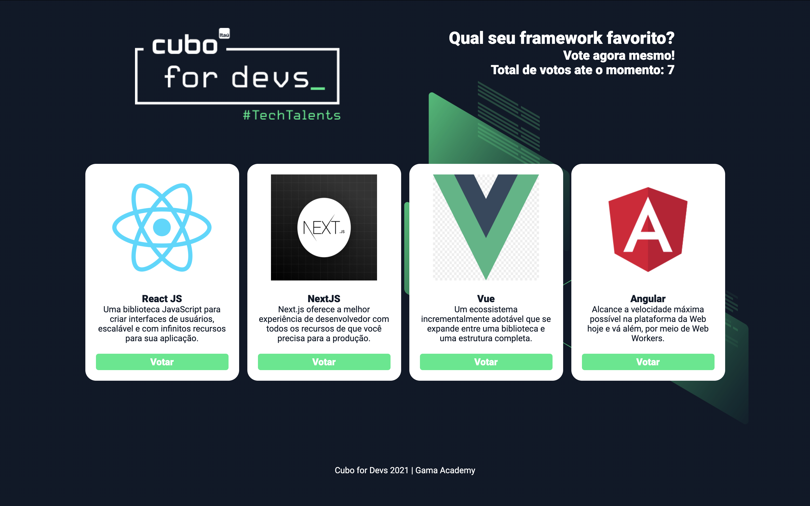

# Live Code | Cubo for Devs

## Sistema de votação com React 

Para instalar as dependências do projeto:
### `yarn`

Iniciar o projeto em desenvolvimento:
### `yarn start`

Para abrir em modo de desenvolvimento acesse [http://localhost:3000](http://localhost:3000) do seu navegador.

Iniciar o json server:
### `yarn server`

## Veja este conteúdo no youtube:

[Clique aqui](https://www.youtube.com/watch?reload=9&v=uslyHgJcrFY).

Por: Douglas Morais.
